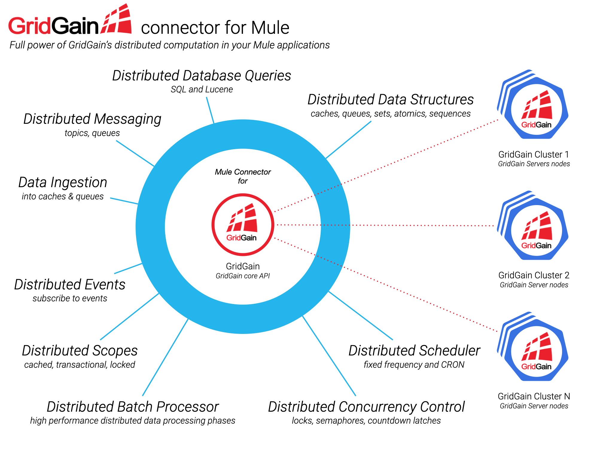

# Hawkore's GridGain connector for Mule 4

_[GridGain®](https://www.gridgain.com) is a memory-centric distributed database, caching, and processing platform for transactional, 
analytical and streaming workloads, delivering in-memory speeds at petabyte scale build on top of [Apache Ignite®](https://ignite.apache.org)._

*All company names, logos, brand names and trademarks are property of their respective owners. All company, product and service names used in this website are for identification purposes only.*

With this connector you can integrate, into your Mule applications, GridGain's features like:

- Distributed synchronization data structures (Lock, Semaphores, CountdowntLatches).
- Distributed atomic data structures (Atomic Long, Atomic Reference, Atomic Sequence and Atomic Stamp).
- Other GridGain's distributed data structures (set, topics, queue and cache).
- SQL and Lucene based queries over caches' data.
- Transactional and cache scopes.
- Distributed scheduler.
- Distributed batches.
- Distributed events.
- Topic based Messaging
- Queue based Messaging
- ...

## Requirements

	-  Java >= 1.8.0_65 (OpenJDK and Sun have been tested)
	-  Maven >= 3.3.0
	-  Mule 4.1.3+
	-  Anypoint Studio 7.5+

## Clone

	-  Clone this project: `git clone http://github.com/hawkore/examples-gridgain-connector-mule4.git`
	-  Change to directory: `cd examples-gridgain-connector-mule4`

## Simple API usage

* `examples-simple-api-usage`: This examples wraps most connector operations and lets you invoke them by
using very simple web forms. See [README.md](examples-simple-api-usage/README.md).

# Other resources

Sign up at [www.hawkore.com](https://www.hawkore.com) to access full documentation.
